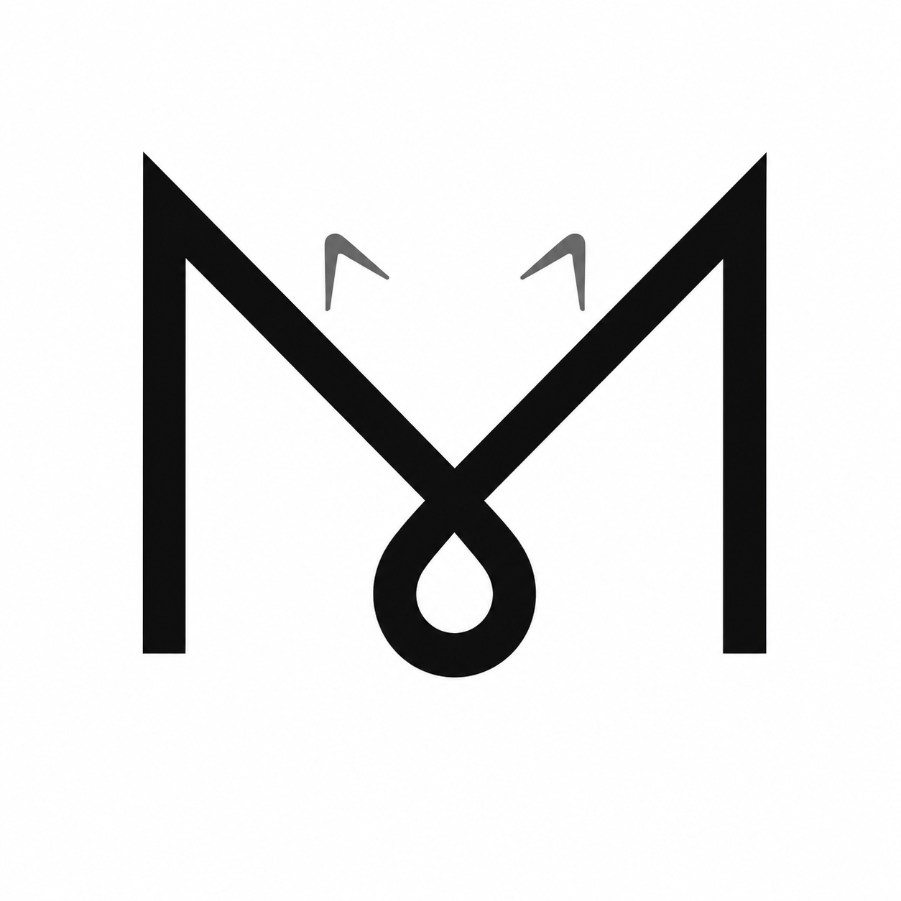

<p align="center">
  
</p>

<h1 align="center">MiNeko Herness</h1>

<p align="center"><strong>Make Everything Happen</strong></p>

<p align="center">A plugin-based Agent Harness with an Electron + Node.js desktop experience for Windows.</p>

[中文](README.zh.md)

MiNeko Herness (`mnh`) is an independent Agent Harness built on the vendored Cordis plugin runtime. The Windows desktop application uses Electron for the interface and Node.js for agents, plugins, tools, sessions, and model adapters. It loads the built client through the private `mnh://` protocol and does not start a Web server or TCP listener.

> **Windows-only project.** MiNeko Herness targets Windows desktop. macOS and Linux desktop releases are not planned. Any non-Windows CI that remains covers reusable repository components, not desktop support.

The project is derived from DeepSeek Harness under the MIT License. MiNeko Herness is not affiliated with or endorsed by DeepSeek.

## Repository facts

These values are read from the current workspace manifests.

| Item | Value | Measured from |
|---|---:|---|
| Node.js requirement | `^22.19.0` or `>=24.0.0` | `package.json#engines` |
| pnpm version | `11.7.0` | `package.json#packageManager` |
| Electron version | `43.4.0` | `apps/desktop/package.json` |
| Workspace projects | 240 | package manifests matched by `pnpm-workspace.yaml` |
| Harness packages | 221 packages in 49 groups | `packages/*/*/package.json` |
| Application projects | 3 | `apps/*/package.json` |

<a id="quick-start"></a><a id="快速开始"></a>

## Start the Windows desktop

Install Git, a supported Node.js version, and pnpm 11, then run:

```sh
git clone https://github.com/Aflydream/Mineko-Harness.git
cd Mineko-Harness
pnpm install
pnpm run build
pnpm run desktop
```

`pnpm run desktop` is the desktop development entry point. It starts the Electron main process and the complete desktop profile; it does not require a browser URL.

## What it provides

- **Plugin composition:** tools, model adapters, storage, permissions, workflows, interface modules, and the agent loop are Cordis plugins composed through profiles and `cordis.yml` layers.
- **Models and reasoning:** sessions select a provider and model from adapter-owned catalogs. Models can declare their supported reasoning levels, which the interface exposes as a per-session choice.
- **Agent workspace:** conversations, tool calls, files, terminals, plans, goals, jobs, workflows, approvals, and delegated agents share one desktop workspace.
- **Durable sessions:** append-only logs support resume, replay, fork, telemetry, and reconstruction of every model-visible input.
- **Replaceable execution:** local and sandboxed filesystem, shell, subprocess, terminal, LSP, Web, skill, and subagent providers can be composed without hard-coding them into the loop.
- **Delegation:** subagent providers cover in-process and forked agents, ACP, Codex, Claude Code, and SDK-backed harness instances when their corresponding runtimes are installed and configured.

## Configure a model

Open **Settings → Models** in the desktop application, add provider credentials, and select a model. The reasoning selector shows only the levels declared by that model. DeepSeek credentials may also come from `DEEPSEEK_API_KEY` and optional `DEEPSEEK_BASE_URL` environment variables; never commit credentials.

The [model setup guide](docs/user/guide/providers.md) covers built-in providers and custom OpenAI-compatible endpoints.

## Repository map

| Path | Responsibility |
|---|---|
| `apps/desktop/` | Electron main process, preload bridge, Windows identity, packaging, and desktop tests |
| `apps/cli/` | Profile bootstrap, command parsing, plugin management, and desktop launch dispatch |
| `apps/web/` | Shared renderer build; Electron serves its output through `mnh://` without starting the Web service |
| `packages/` | 221 harness packages grouped by capability, including core, LLM, tools, sessions, client, API, workflow, and subagents |
| `examples/` | Runnable profile compositions and snapshot scenarios |
| `native/` | Isolated native helpers for repository infrastructure, not desktop targets |
| `python/` | Python SDK and bundled runtime |
| `docs/` | User, plugin, and Cordis tutorials |
| `AgentGuide/` | Coding-agent onboarding, architecture, ownership, and engineering rules |
| `vendor/` | Pinned Cordis sources maintained by the repository vendoring procedure |
| `website/` | Documentation site projection |
| `scripts/` | Builds, release tooling, generators, and repository checks |

<a id="development"></a>

## Learn and contribute

- [Use the application](docs/user/guide/index.md)
- [Build your first Harness plugin](docs/user/develop/basic/index.md)
- [Learn the Cordis plugin runtime](docs/cordis-tutorial/index.md)
- [Read the AgentGuide](AgentGuide/README.md)
- [Read the contribution guide](CONTRIBUTING.md)

## Contributing

Issues and pull requests are welcome. Use the repository's Issue templates for bugs, features, research, and tasks. Pull requests should stay within the Windows desktop scope, reference a same-repository Issue, describe the user-visible change, and include focused verification. Read [CONTRIBUTING.md](CONTRIBUTING.md) before opening one.

MiNeko Herness is distributed under the [MIT License](LICENSE). Third-party packages, vendored sources, and license notices are recorded in [THIRD_PARTY_NOTICES.md](THIRD_PARTY_NOTICES.md).

## Community
- [linux.do](https://linux.do/)
- QQ
> COMING SOON
